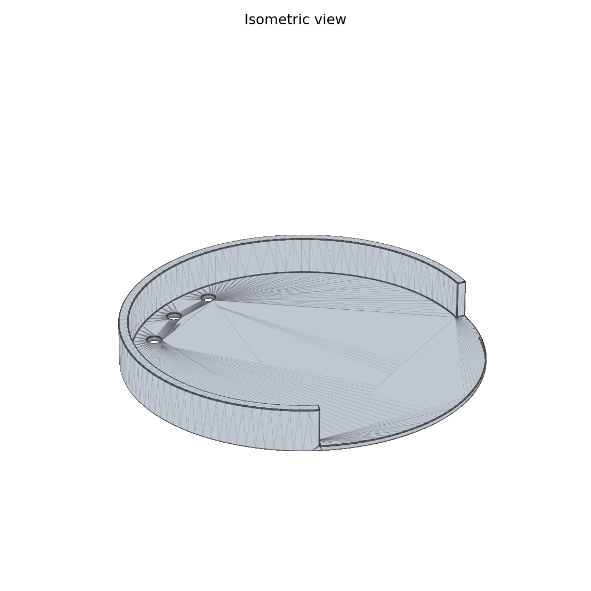
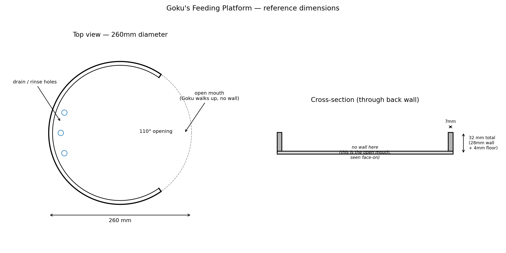

# Goku's Feeding Platform

A low "horseshoe corral" feeding platform for Goku (sulcata tortoise, ~19cm
carapace, indoor enclosure with coco-coir/mulch substrate). Goal: hold his
daily ~250g of endive in one place, off the substrate, without him
scattering leaves into the sediment while he eats.




## Design

- **Floor disc**: 260mm diameter, 4mm thick. Sits directly on the substrate
  — barely a step, so there's nothing to climb even at the platform's edge.
- **Corral wall**: 28mm tall, 7mm thick, wrapped around **250°** of the
  circle. This keeps greens from getting pushed off the back/sides as Goku
  noses through the pile.
- **Open mouth**: the remaining **110°** at the front has *no wall at all* —
  Goku walks straight up to the pile and eats at ground level, no ramp or
  lip to deal with. All edges are filleted so the wall ends where the mouth
  begins aren't sharp.
- **3 drain holes** (10mm dia) through the floor near the back wall, so you
  can hose/rinse the tray without water pooling.
- Every edge is filleted (~1-2mm) — no sharp corners against his neck, legs,
  or beak.

Overall footprint is 260mm × 260mm × 32mm tall — comfortably smaller than
your enclosure floor (~80×45cm) and well within the Bambu H2D's 350×320mm
plate as a single print.

## Files

- `cad/feeder.py` — parametric FreeCAD (Part workbench) script. All
  dimensions are constants at the top — edit and re-run to rescale as Goku
  grows or to change the wall height / mouth angle.
- `output/goku_feeder.stl` — print this.
- `output/goku_feeder.step` — parametric solid, for Fusion 360 / other CAD
  if you want to inspect or hand-edit it later.
- `output/preview_top.png`, `output/preview_iso.png` — quick renders.
- `output/dimensions.png` — dimensioned top view + cross-section.

To regenerate after editing `feeder.py`:

```bash
/Applications/FreeCAD.app/Contents/Resources/bin/freecadcmd cad/feeder.py
```

## Print settings (Bambu H2D)

- **Material: PETG.** Better than PLA for a humid enclosure that gets
  misted/rinsed — PLA can soften/warp with repeated moisture + the ambient
  heat from a basking lamp nearby. PETG is also easier to wipe down and more
  impact-resistant if Goku bulldozes it.
- **Nozzle**: stock 0.4mm is fine.
- **Layer height**: 0.2mm.
- **Walls**: 3 perimeters minimum (part is load-bearing under a stepping
  tortoise, not just cosmetic).
- **Top/bottom layers**: 5+, so the floor is fully solid/watertight for
  rinsing.
- **Infill**: 15–20% gyroid is plenty — the floor's solid top/bottom layers
  do the structural work.
- **Orientation**: print flat, floor-down, exactly as modeled. No supports
  needed — the wall is a simple vertical extrusion and the mouth opening
  has no overhangs.
- **Bed adhesion**: standard PETG settings on the H2D's textured plate;
  no brim needed given the wide flat floor contact area.
- Wash before first use; no food-safe certification claimed, just PETG's
  general chemical inertness and easy-to-clean surface.

## If Goku outgrows it

Bump `OUTER_R`, `WALL_HEIGHT`, and `DRAIN_HOLE_RADIAL_POS` in `feeder.py`
proportionally and re-run. Keep `WALL_THICK` around 6–8mm regardless of
scale — that's sized for print strength, not tortoise size.
